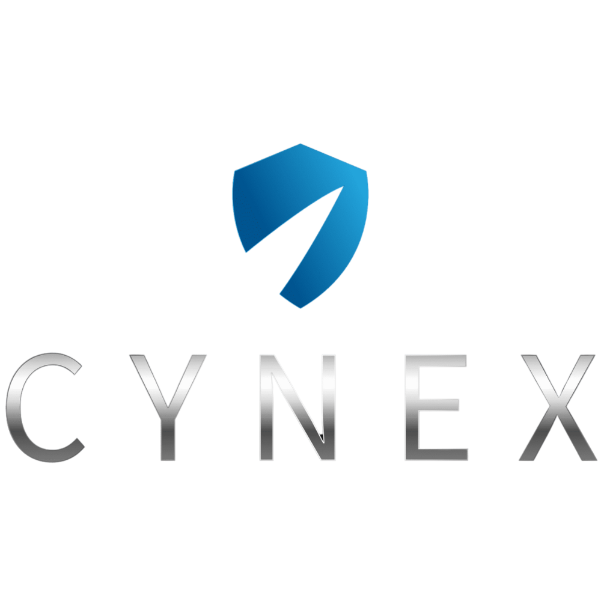

# CYNEX — Network & Security Landing Page



A modern, high-performance landing page for **CYNEX**, showcasing security, networking, and smart automation solutions.  
Built with **HTML, CSS, and JavaScript** (no frameworks). Fully responsive, accessible, and lightweight.

<p align="left">
  
  
  
  
</p>

## ✨ Features
- Futuristic dark UI with brand-accurate accents (blue for CTAs/hover/focus)
- Smooth animations: hero glow/parallax, reveal-on-scroll, 3D tilt cards
- Accessible, keyboard-friendly projects slider
- Responsive layout (Flexbox + Grid)
- No React/Vue/Tailwind/Bootstrap — pure static stack

## 📦 Folder Structure
```
cynex-landing-page/
├── index.html
├── css/
│   └── styles.css
├── js/
│   └── script.js
└── assets/
    ├── images/
    │   ├── logo.png
    │   ├── hero-bg.png
    │   ├── project-1.jpg
    │   ├── project-2.jpg
    │   └── project-3.jpg
    ├── icons/
    │   └── favicon.ico
    └── colors/
        └── palette.png
```

## 🎨 Brand Colors
- Primary: `#1382BA`
- Secondary: `#084C7A`
- Accent: `#6A6A6A`
- Background: `#0F0F0F`
- Dark: `#1B1B1B`

> Blue is reserved for interactions (CTA / hover / focus). Black/gray for surfaces.

## 🚀 Quick Start
**Option A — open directly**
- Double-click `index.html`.

**Option B — Live reload (recommended)**
- VS Code → install **Live Server** → right-click `index.html` → *Open with Live Server*.

**Option C — Simple local server**
```bash
# Python 3
python -m http.server 5500
# open http://localhost:5500
```

## 🧩 Sections
1. **Header** (sticky, logo + navigation + mobile hamburger)  
2. **Hero** (animated background/parallax, headline, CTA)  
3. **About**  
4. **Services** (interactive cards + 3D tilt)  
5. **Why CYNEX** (4 highlights)  
6. **Projects / Case Studies** (slider)  
7. **Testimonials**  
8. **Contact** (address, phone, website, email + simple form)  
9. **Footer** (auto year)

## 🔧 Customize
- **Logo**: replace `assets/images/logo.png`  
- **Favicon**: replace `assets/icons/favicon.ico`  
  ```html
  <!-- already in <head> -->
  <link rel="icon" href="assets/icons/favicon.ico" type="image/x-icon">
  ```
- **Hero copy & CTA**: edit `#hero` in `index.html`
- **Services**: edit cards in the *Services* section
- **Projects**: swap images `project-*.jpg` + captions inside `.slide`
- **Contact info**: update inside `#contact`

## 🧠 Accessibility & Performance
- High-contrast theme, visible focus states
- Keyboard support for slider controls
- Add `loading="lazy"` to non-critical images if needed
- Set `width`/`height` on `` to reduce layout shift

## 🔍 SEO (basic meta)
Add/edit in `<head>` of `index.html`:
```html
<title>CYNEX — Network & Security Solutions</title>
<meta name="description" content="Security systems, networking, and smart automation for businesses and homes in Kuwait.">
<meta property="og:title" content="CYNEX — Network & Security Solutions">
<meta property="og:description" content="Connected. Protected. Automated.">
<meta property="og:type" content="website">
<meta property="og:image" content="assets/images/hero-bg.png">
<meta name="theme-color" content="#0F0F0F">
```

## 🛠️ Tooling (optional)
This repo is framework-free. If you later add a bundler, keep output paths compatible with:
- `css/styles.css`
- `js/script.js`
- `assets/**`

## 📸 Screenshots
> Replace with your own captures.
```


```

## 🗺️ Roadmap
- Form backend (Formspree / Netlify Forms / custom API)
- WebP images & further compression
- Multi-language (EN / AR)

## 📄 License
MIT — see `LICENSE`.

## 📬 Contact
**CYNEX**  
Al Saqran Tower, Hawally, Floor 1, Office No. 3  
+965 50503025 • info@cynex.pro • https://www.cynex.pro
